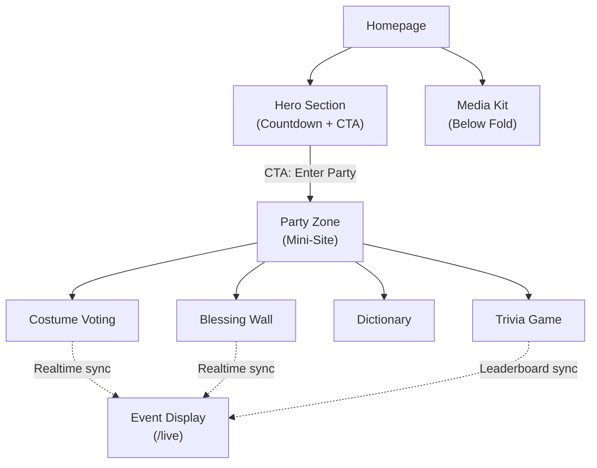
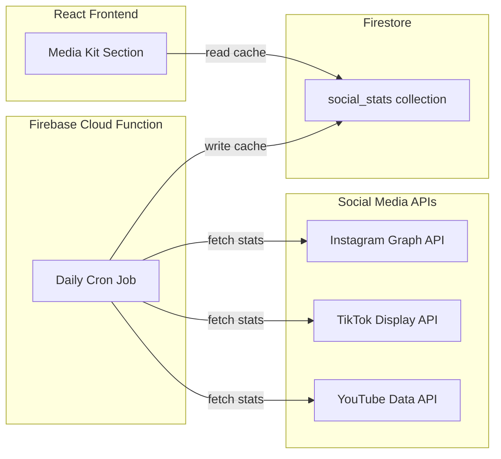
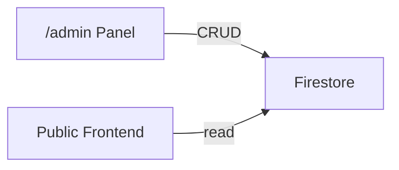

# Requirements: Miryam Segal Website

## 1. Tech Stack

- **Frontend**: React 19 + Vite + Tailwind CSS 4
- **Routing**: React Router v7
- **Backend/DB**: Firebase (Authentication, Firestore, Realtime Database)
- **Hosting**: Vercel (React/Vite optimized, custom domain, SSL)
- **Forms**: Firebase Firestore + Email notification (via Firebase Cloud Functions or EmailJS)
- **Fonts**: Rubik (headings), Noto Sans Hebrew (body) -- per approved design system
- **Direction**: RTL, Mobile First
- **Social APIs**: Instagram Graph API, TikTok Display API, YouTube Data API v3

## 2. UI Component Library (Design Abstraction Layer)

All UI is built from a **centralized component library** so that design changes propagate from a single source. No page or feature should use raw HTML elements directly — everything goes through the component layer.

### Core Components

| Component     | Variants / Props                                                                                              | Purpose                                                                         |
| ------------- | ------------------------------------------------------------------------------------------------------------- | ------------------------------------------------------------------------------- |
| `<Heading>`   | `level` (1-6), `gradient` (boolean), `as` (semantic tag override)                                             | All headings site-wide, maps to Rubik font                                      |
| `<Text>`      | `variant` (body/secondary/muted/label), `size` (sm/base/lg/xl)                                                | All body text, maps to Noto Sans Hebrew                                         |
| `<Button>`    | `variant` (cta/primary/secondary/ghost), `size` (sm/md/lg), `loading`, `disabled`, `icon`, `as` (link/button) | All clickable actions — CTA underline style, filled gradient, outline, or ghost |
| `<Input>`     | `type` (text/email/textarea/file), `label`, `error`, `helperText`, RTL-aware                                  | Form inputs with built-in validation display                                    |
| `<Card>`      | `variant` (top/accent/side), `hoverable`, `as` (div/link)                                                     | All card patterns from design system                                            |
| `<Badge>`     | `variant` (default/success/warning/error), `size`                                                             | Status indicators, counters                                                     |
| `<Modal>`     | `open`, `onClose`, `title`, `size`                                                                            | Dialogs and confirmations                                                       |
| `<Toast>`     | `type` (success/error/info), `message`, `duration`                                                            | Notifications via context provider                                              |
| `<Skeleton>`  | `variant` (text/circle/card/image), `lines`                                                                   | Loading placeholders                                                            |
| `<Container>` | `size` (sm/md/lg/xl/full), `padding`                                                                          | Consistent page width and padding                                               |
| `<Section>`   | `id`, `className`                                                                                             | Page sections with scroll-reveal animation built-in                             |
| `<Countdown>` | `targetDate`, `onComplete`                                                                                    | Reusable countdown timer                                                        |
| `<StatCard>`  | `value`, `label`, `gradient`                                                                                  | Media kit stat display                                                          |
| `<Marquee>`   | `speed`, `children`                                                                                           | Infinite scroll container for logos                                             |

### Design Token Flow

```
BRAND-GUIDE.md (source of truth)
    ↓
src/index.css @theme {} (Tailwind CSS 4 design tokens)
    ↓
src/components/ui/*.tsx (consume tokens via Tailwind classes)
    ↓
src/pages/*.tsx (compose from components — NEVER raw HTML)
```

### Rules

- **NEVER** use raw `<h1>`, `<p>`, `<button>`, `<input>` in pages — always use the component
- All design tokens (colors, spacing, typography) live in `src/index.css` `@theme {}`
- Component files live in `src/components/ui/`
- If a design change is needed, it should require editing **one file** maximum

## 3. Route Configuration & Access Control

### Centralized Route Config

All routes are defined in a **single config file** (`src/config/routes.ts`) that acts as the source of truth. The router reads from this config — no scattered route definitions.

```typescript
// src/config/routes.ts
interface RouteConfig {
  path: string;
  title: string; // Page title (for <title> tag and nav)
  component: LazyComponent; // Lazy-loaded page component
  layout: 'root' | 'party' | 'none';
  access: 'public' | 'authenticated' | 'admin';
  showInNav?: boolean; // Whether to show in navigation menu
  navLabel?: string; // Label in nav (Hebrew)
  navIcon?: LucideIcon; // Icon in nav
  meta?: {
    description?: string;
    noIndex?: boolean; // For admin/live pages
  };
}
```

### Route Definitions

| Path                | Layout | Access | Nav                 |
| ------------------- | ------ | ------ | ------------------- |
| `/`                 | root   | public | Yes — "בית"         |
| `/party`            | party  | public | Yes — "מתחם המסיבה" |
| `/party/trivia`     | party  | public | Yes — "טריוויה"     |
| `/party/blessings`  | party  | public | Yes — "קיר ברכות"   |
| `/party/dictionary` | party  | public | Yes — "מילון"       |
| `/party/vote`       | party  | public | Yes — "הצבעות"      |
| `/live`             | none   | public | No                  |
| `/admin`            | none   | admin  | No                  |
| `/admin/trivia`     | none   | admin  | No                  |
| `/admin/blessings`  | none   | admin  | No                  |
| `/admin/costumes`   | none   | admin  | No                  |
| `/admin/dictionary` | none   | admin  | No                  |
| `/admin/cases`      | none   | admin  | No                  |

### Access Control Architecture

```
User visits route
    ↓
RouteGuard checks route config `access` field
    ↓
├── 'public' → render immediately
├── 'authenticated' → check Firebase Auth state
│   ├── logged in → render
│   └── not logged in → redirect to login
└── 'admin' → check Firebase Auth + admin role
    ├── has admin role → render
    └── no admin role → redirect to /
```

### Firebase Auth Integration Plan

- **Phase 1 (current)**: Simple password check via env var (existing)
- **Phase 2 (future)**: Firebase Authentication with email/password login
- **Phase 3 (future)**: Role-based access — `users` Firestore collection with `role` field (`admin` / `user`)
- **Auth Context**: `src/contexts/AuthContext.tsx` — provides `user`, `role`, `isAdmin`, `login()`, `logout()`
- **Route Guards**: `src/components/guards/AuthGuard.tsx`, `AdminGuard.tsx` — wrap protected routes
- The route config makes it trivial to change a route's access level — just change the `access` field

### Config-Driven Navigation

The `Navbar` component reads from the route config to render nav links. Adding a new page = adding one entry to the config file. No need to touch Navbar code.

## 4. Animation System

### Research Phase — Award-Winning References

Before implementing animations, research and document patterns from:

- **Awwwards SOTD** — site-of-the-day winners with dark/editorial aesthetics
- **GSAP ShowCase** — advanced scroll-triggered and timeline animations
- **Framer Motion examples** — React-native animation patterns
- **Linear.app** — smooth page transitions, subtle micro-interactions
- **Stripe.com** — gradient animations, number counting, scroll reveals
- **Vercel.com** — clean entrance animations, staggered grids

### Animation Categories

| Category               | Technique                                                     | Where Used                        |
| ---------------------- | ------------------------------------------------------------- | --------------------------------- |
| **Page transitions**   | Fade + slide between routes (300ms ease-in-out)               | All route changes                 |
| **Scroll reveal**      | Elements animate in at 70-80% viewport (opacity + translateY) | All sections                      |
| **Staggered entry**    | Children animate in sequence with 80-120ms delay              | Card grids, nav links, stat cards |
| **Micro-interactions** | Hover lift, press scale, focus glow                           | Buttons, cards, inputs            |
| **Counter animation**  | Numbers count up from 0 to target value                       | Stats in media kit                |
| **Countdown tick**     | Flip/slide animation on digit change                          | Hero countdown timer              |
| **Parallax**           | Subtle depth on scroll                                        | Hero image, orbs                  |
| **Celebration**        | Confetti burst on trivia completion, vote submission          | Party zone interactions           |
| **Marquee**            | Infinite smooth scroll                                        | Brand logos                       |
| **Loading states**     | Skeleton shimmer, spinner                                     | Data fetching                     |
| **Background motion**  | Slow-drifting orbs, subtle gradient shifts                    | All pages                         |

### Technical Approach

- **Library**: Evaluate Framer Motion vs GSAP vs CSS-only (decide during research)
- **Performance**: All animations must respect `prefers-reduced-motion`
- **Mobile**: Reduce/simplify animations on mobile for performance
- **Reusability**: Animation primitives as React components/hooks:
  - `<AnimateOnScroll>` — wrapper that triggers entrance animation on scroll
  - `<StaggerChildren>` — wrapper that staggers children's entrance
  - `<PageTransition>` — route transition wrapper
  - `useCountUp(target)` — hook for animated number counting
  - `useParallax(speed)` — hook for parallax scroll effect
  - `confetti()` — imperative function for celebration bursts

### Animation Motion Values (from BRAND-GUIDE.md)

| Type            | Duration    | Easing      | Notes                      |
| --------------- | ----------- | ----------- | -------------------------- |
| Hover           | 150-220ms   | ease-out    | Cards, buttons             |
| Scroll reveal   | 400-600ms   | ease-out    | Sections entering viewport |
| Stagger delay   | 80-120ms    | ease-out    | Between sibling elements   |
| Page transition | 300ms       | ease-in-out | Route changes              |
| Counter         | 1500-2000ms | ease-out    | Number counting up         |
| Celebration     | 2000ms      | ease-out    | Confetti burst             |

## 5. Site Architecture



**Routes:**

- `/` -- Homepage (Hero + Media Kit)
- `/party` -- Party Zone hub
- `/party/trivia` -- Trivia game
- `/party/blessings` -- Blessing wall
- `/party/dictionary` -- Dictionary
- `/party/vote` -- Costume voting
- `/live` -- Event display screen (no nav, auto-refresh, for TV at physical event)
- `/admin` -- Admin panel (password protected via env var)

## 6. Homepage -- Hero Section

- **Full-bleed image** with dark overlay (from existing studio photos)
- **Title**: "מרים סגל" in gradient text (Rubik 700)
- **Subtitle**: short tagline
- **Countdown timer** to March 5, 2026 -- showing days:hours:minutes:seconds, live ticking
- **CTA button**: "היכנסו למסיבה" -- navigates to `/party`
- After the birthday: countdown disappears, CTA remains

## 7. Homepage -- Media Kit (Below Fold)

### 4a. Live Social Stats

Pull real data via APIs. Miryam must authorize OAuth access.

- **Instagram** (Graph API): followers, engagement rate, audience demographics
- **TikTok** (Display API): followers, likes, video views
- **YouTube** (Data API v3): subscribers, total views

Display as 4-6 stat cards with gradient numbers (per design system).

**Fallback**: If API fails, show cached/last-known values from Firestore.

**API refresh**: Server-side function runs daily, caches stats in Firestore. Frontend reads from Firestore (never calls APIs directly from client).

### 4b. Brand Logos

Marquee scroll of brand logos Miryam has worked with (e.g., L'Oreal). Placeholder slots until real logos are provided.

### 4c. Case Studies

2-3 cards showing past campaigns: image + brand name + brief description + metrics. Managed via admin panel, stored in Firestore (`case_studies` collection).

### 4d. About Section

Short bio paragraph + profile photo (from existing images).

### 4e. Contact Form (B2B)

Fields: Name, Company, Email, Message.
On submit:

1. Save to Firebase Firestore (`contacts` collection)
2. Send email notification to Miryam's email (via EmailJS or Firebase Cloud Function)
3. Show success confirmation

## 8. Party Zone

### 5a. Entry Experience

- Transition animation from Homepage into party zone
- Different background feel (more energetic accent, per design system birthday section)
- Internal navigation: 4 cards/tabs for the 4 modules

### 5b. Navigation

- **Header**: "חזור הביתה" button (returns to `/`)
- **Hamburger menu**: global, links to all main sections
- The "חזור הביתה" button only visible inside party zone routes

## 9. Trivia Game

### Flow

1. **Start screen**: "הטריוויה של מרים" + "התחילו" button + nickname input
2. **Questions**: 10 questions, one at a time, 4 options each
3. **Answer feedback**: Instant green/red highlight, auto-advance after 1.5s
4. **Results screen**: Score X/10 + personalized message + leaderboard position
5. **Share button**: Copy text + link ("קיבלתי X/10 בטריוויה של מרים!")

### One Attempt Per Person

- Nickname required before starting
- After completion, score saved to Firebase Firestore (`trivia_scores` collection: nickname, score, timestamp)
- localStorage flag prevents replay on same device
- Leaderboard shows top 20 scores (sorted by score desc, then time asc)

### Data Source

Questions stored in Firestore (`trivia_questions` collection), managed via admin panel.
Seeded with initial draft questions on first deploy:

1. באיזה תאריך נולדה מרים? (5/3 | 27/2 | 15/4 | 1/1)
2. באיזו פלטפורמה מרים התחילה את הקריירה שלה? (TikTok | Instagram | YouTube | Twitter)
3. עם איזה מותג מרים שיתפה פעולה בקמפיין שקיבל מעל 2.7 מיליון צפיות? (L'Oreal | MAC | Dior | Chanel)
4. מה המזל של מרים? (דגים | מאזניים | בתולה | טלה)
5. איזו יוצרת תוכן ישראלית חברה של מרים? (נועה בוגוסלבסקי | נועה קירל | אגם בוחבוט | ליהיא גרינר)
6. באיזו תוכנית טלוויזיה מרים הופיעה? (אז ככה | האח הגדול | הישרדות | נינג'ה ישראל)
7. מתי מרים פרסמה את הפוסט הראשון שלה באינסטגרם? (ספטמבר 2020 | ינואר 2019 | יוני 2021 | מרץ 2018)
8. באיזו מדינה מרים נולדה? (ישראל | ארה"ב | צרפת | אנגליה)
9. על איזה נושא מרים העלתה מודעות ציבורית? (שימוש לרעה ב-AI | זכויות בעלי חיים | איכות הסביבה | חינוך)
10. כמה עוקבים יש למרים בטיקטוק? (600K+ | 100K | 1M+ | 300K)

Miryam can edit/add/remove questions at any time via the admin panel.

## 10. Blessing Wall

### User Flow

1. Click "כתוב/י ברכה"
2. Form: Name (required) + Message (required, max 280 chars) + Photo (optional, max 5MB)
3. Submit -- auto-filter for offensive words (Hebrew + English bad-word list)
4. If passes filter: published immediately
5. If caught by filter: held for manual review (flagged in Firestore)

### Display

- Masonry grid of blessing cards
- Each card: name, message, photo (if uploaded), timestamp
- Sorted newest first
- Real-time updates (new blessings appear without refresh)

### Backend

- Firestore collection: `blessings` (name, message, photoURL, timestamp, status: published/flagged)
- Firebase Storage for uploaded photos
- Bad-word filter runs client-side before submit

## 11. Dictionary

- **5+ terms/expressions** unique to Miryam (managed via admin panel)
- Content stored in Firestore (`dictionary` collection), editable from admin
- Display: `card-side` style (per design system) with term title + explanation

## 12. Costume Voting

### Setup

- **1 category**: "התחפושת הכי טובה"
- Candidates uploaded in advance by Miryam (admin panel or hardcoded initially)
- Each candidate: name/title + photo

### Voting Flow

1. QR scan at physical event --> opens `/party/vote`
2. User sees all candidates as photo cards
3. Tap to vote (one vote total per device, stored in localStorage + Firestore)
4. After voting: see live results bar chart
5. Results update in real-time (Firebase Realtime Database)

### Anti-Fraud

- localStorage prevents re-voting on same device
- Optional: device fingerprint for extra protection

## 13. Event Display Screen (`/live`)

A dedicated full-screen page designed for a TV/projector at the physical event. No navigation, no interaction needed.

### Content (auto-rotating sections, ~10s each):

1. **Costume Voting Results** -- live bar chart, updates in real-time
2. **Latest Blessings** -- scrolling feed of newest blessings from the wall
3. **Trivia Leaderboard** -- top 10 scores
4. **Countdown/Birthday message** -- before/during event

### Technical

- Route: `/live`
- Auto-refresh data via Firebase real-time listeners
- Full-screen mode (no scrollbars, no UI chrome)
- Large typography optimized for viewing from distance
- Background matches party zone aesthetic
- Sections rotate automatically with smooth transitions

## 14. QR Code

- **Single QR code** that opens `/party` (the party zone entrance)
- Generated as high-res PNG/SVG for print
- Printed on physical materials at the event (posters, table cards, etc.)
- The QR URL should include a UTM parameter for analytics: `?utm_source=event_qr`

## 15. Social Media API Architecture



**Setup required from Miryam:**

- Instagram: Connect Business/Creator account to Facebook Page, create Meta App, grant permissions
- TikTok: Authorize via TikTok Developer portal OAuth
- YouTube: Only needs channel ID (public API with API key)

## 16. Admin Panel (`/admin`)

### Authentication (Phased Approach)

**Phase 1 (MVP):** Simple password-based login — password stored as env var (`VITE_ADMIN_PASSWORD`), session in sessionStorage.

**Phase 2 (Post-launch):** Firebase Authentication with email/password. Admin role stored in Firestore `users` collection with `role: 'admin'`. Auth state managed via `AuthContext` provider. Route guards read from centralized route config (see Section 3).

- Access controlled via route config `access: 'admin'` field
- `AdminGuard` component wraps admin routes, checks auth state + role
- No public link to admin — access by typing `/admin` directly

### Admin Sections

**Trivia Manager**

- View all 10 questions in a list
- Edit any question: question text, 4 options, correct answer index
- Add new questions / delete existing ones
- Reorder questions via drag-and-drop or arrows
- Changes save to Firestore (`trivia_questions` collection)
- Frontend trivia game reads questions from Firestore (not hardcoded)

**Blessings Moderator**

- Tab 1: "Published" -- all live blessings, option to hide/delete
- Tab 2: "Flagged" -- blessings caught by bad-word filter, option to approve or delete
- Each card shows: name, message, photo thumbnail, timestamp
- Bulk actions: select multiple and approve/delete

**Costume Candidates Manager**

- Add candidate: name + photo upload (Firebase Storage)
- Edit candidate name
- Delete candidate
- View current vote counts per candidate
- Option to reset all votes (with confirmation)
- Data stored in Firestore (`costume_candidates` collection)

**Dictionary Editor**

- Add/edit/delete terms
- Each term: title + explanation text
- Reorder terms
- Data stored in Firestore (`dictionary` collection)

**Case Studies Editor**

- Add/edit/delete case studies
- Each entry: brand name, image upload, description, metrics (e.g., views, engagement)
- Data stored in Firestore (`case_studies` collection)

### Data Flow with Admin



All dynamic content flows: Admin writes to Firestore, public frontend reads from Firestore. This means Miryam can update trivia questions, add costume candidates, manage blessings, edit dictionary terms, and update case studies at any time without touching code.

## 17. Design System Reference

All UI follows the approved design system:

- [design-system.html](design-system.html) -- visual reference
- [BRAND-GUIDE.md](BRAND-GUIDE.md) -- written specifications
- Colors: `#0a0a0a` bg, `#6366f1` -> `#a855f7` accent gradient
- Cards: 2px accent top line, straight corners
- Typography: Rubik headings, Noto Sans Hebrew body
- Motion: 180ms hover, 500ms scroll reveal, ease-out

## 18. Content Still Needed from Miryam

**Before launch (required):**

- Social media account handles (Instagram, TikTok, YouTube)
- OAuth authorization for API access
- Contact email for B2B form notifications
- Short bio text for About section
- Brand logos for marquee (L'Oreal confirmed, others?)

**Can be added via admin panel after launch:**

- Trivia questions (seeded with 10 draft questions, editable)
- Dictionary terms (add/edit anytime)
- Case studies (add/edit anytime)
- Costume contest candidates (add closer to event)
- Blessing moderation (ongoing)
